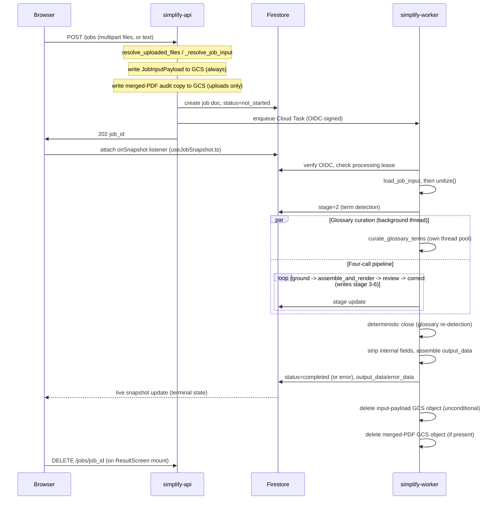

# Flow: One Note, Start to Finish

**Start here if you're new to this codebase.** This document traces one concrete note —
a PDF a visitor drags onto the upload screen — from the moment it's dropped to the
moment a rendered care plan appears and the job document is gone. Every function, file,
and Firestore/GCS write named below is a real, grep-able symbol; each beat below gets one
paragraph plus a pointer to where the full mechanism lives ([`pipeline.md`](pipeline.md),
[`architecture.md`](architecture.md), [`data-and-privacy.md`](data-and-privacy.md)) — this
document sequences them, it does not re-derive them.

## The thirteen beats

1. **Anonymous sign-in.** On page load, `frontend/src/hooks/useAnonAuth.ts` calls
   Firebase's `signInAnonymously()` — no email, password, or personal information is
   collected. The resulting anonymous Firebase UID is attached as a bearer token to
   every request this session makes.
2. **Upload or paste.** `components/UploadScreen.tsx` accepts either pasted text or up to
   5 files. Before anything is sent, `utils/validateFiles.ts` mirrors the backend's own
   caps client-side (file count, aggregate size, allowed extensions) so an obviously
   invalid submission never makes a round trip.
3. **`POST /jobs` reaches `simplify-api`.** `routes/jobs.py::_resolve_job_input` extracts
   text from the request, builds per-(file, page) `SourceSpan` provenance, and writes
   one GCS object — `JobInputPayload{text, provenance}` — via `upload_job_input`. For a
   file upload it also writes a separate, optional merged-PDF audit copy. See
   [`architecture.md`](architecture.md) §2 for the exact object shapes and their two
   distinct lifecycles.
4. **`JobDoc` created in Firestore**, `status="not_started"`, carrying the GCS URIs
   returned by step 3 — never raw text or provenance inline. See
   [`architecture.md`](architecture.md)'s job-doc field table for the full field list.
5. **Cloud Task enqueued**, OIDC-signed, targeting `simplify-worker`'s internal execute
   route — decoupling job creation from job execution so `POST /jobs` never blocks on
   pipeline work.
6. **`202 {"job_id": ...}` returns**, immediately after both the Firestore write (step 4)
   and the Cloud Task enqueue (step 5) — the frontend then attaches a live Firestore
   listener (`hooks/useJobSnapshot.ts`) to the new job document and shows
   `components/ProcessingScreen.tsx`.
7. **The worker picks up the task**, verifies the request really carries a valid OIDC
   token for the configured worker service account, and checks the processing lease
   (has some other delivery of this same task already claimed it, and is that claim
   still fresh?) — see [`architecture.md`](architecture.md)'s idempotency section for why
   this matters under Cloud Tasks' at-least-once delivery.
8. **`load_job_input` downloads and parses the GCS payload**; `unitize()` (from
   `services/unitizer.py`) then materializes `list[Unit]` — the numbered, per-line
   evidence list every later citation resolves against — entirely in memory, before any
   LLM call runs. See [`pipeline.md`](pipeline.md) §1 for why unitization exists at all.
9. **Term detection runs** (deterministic, no LLM call), and the glossary-curation
   background thread starts right after it, on its own thread pool, running alongside
   everything that follows.
10. **The four LLM calls run in sequence** — `ground` → `assemble_and_render` → `review`
    → `correct` — each writing a `stage` update the frontend's Firestore listener picks
    up live as it happens. One paragraph covers all four here deliberately (per-call
    depth is too deep for this document); the diagram below carries the sequencing, and
    [`pipeline.md`](pipeline.md) §4 covers what each call actually does and every
    deterministic check around it.
11. **The deterministic close** runs: glossary re-detection against the final care plan
    (`build_glossary_from_care_plan`). The adapter then assembles `output_data` and the
    worker strips internal-only fields (`routes/worker.py::_strip_internal_provenance`)
    before anything is written back.
12. **`complete_job` writes the terminal Firestore update** — `status="completed"` and
    the stripped `output_data` (or `fail_job` writes `error_data` and `status="error"` on
    an unrecoverable failure) — and, either way, the worker's `finally` block deletes
    both GCS objects: the input-payload object unconditionally, the merged-PDF audit
    copy if one was written in step 3.
13. **The frontend's listener sees the terminal state** and renders
    `components/ResultScreen.tsx`, which in turn renders `components/CarePlanView.tsx`
    for the structured result. `ResultScreen.tsx` fires `DELETE /jobs/<job_id>` the
    instant it mounts — see [`data-and-privacy.md`](data-and-privacy.md)'s deletion-path
    table for this and every other path that can remove the job document.

## The diagram

GCS and Cloud Tasks deliberately don't get their own swimlane — they're mechanism, not
decision points, at this level of detail — so they're folded in as notes and as implicit
actions on the arrows that touch them (the "enqueue Cloud Task" arrow, the two delete
self-messages). Notice the two Firestore-facing arrows from `simplify-api` — the job-doc
creation and the Cloud Task enqueue — both land **before** the `202` response, matching
`routes/jobs.py`'s comment that this route "never orphans a doc": a configuration error
is caught before either write happens, never after one but not the other. The `par`
block makes the glossary-curation thread's concurrency with the four-call pipeline
visually explicit, rather than leaving "runs at the same time" to prose alone. The
dashed arrow from `Firestore` back to `Browser` is deliberately a different style from
the solid `202` response — one is a synchronous HTTP reply, the other is Firestore's
push-based listener firing whenever the document changes, not a poll.
